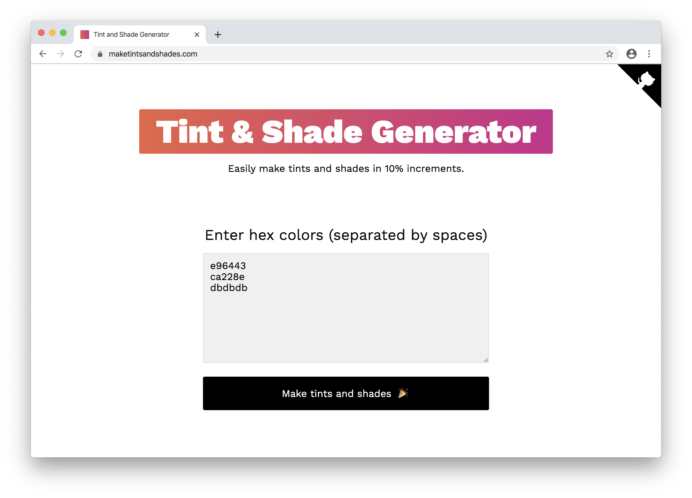
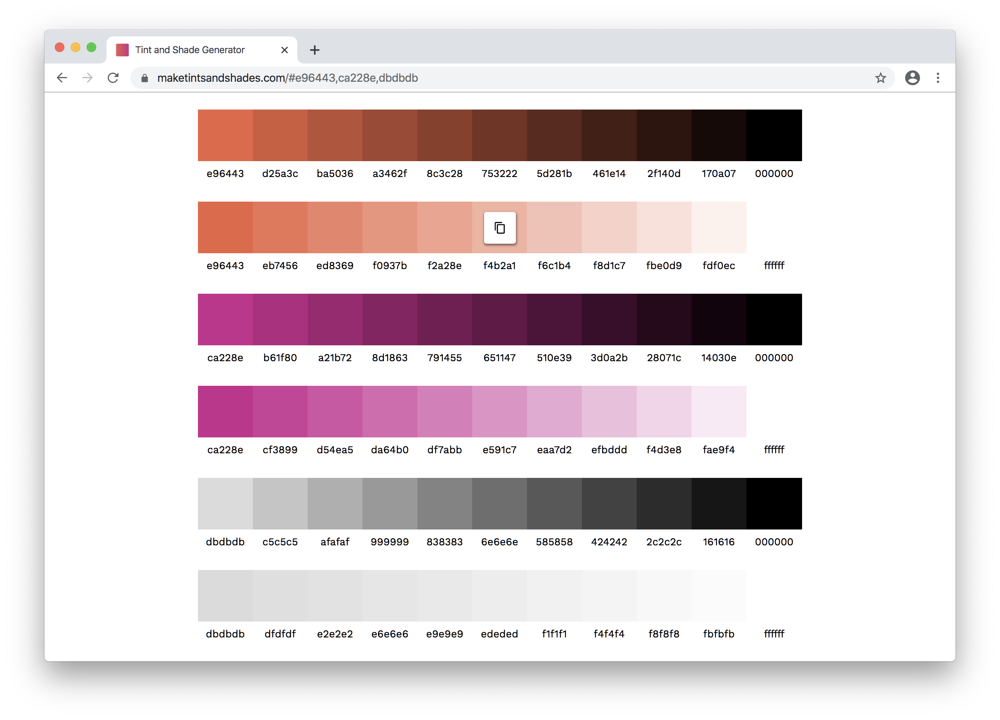

#  &nbsp;[Tint & Shade Generator](https://maketintsandshades.com)

## What is the Tint & Shade Generator?
The purpose of this tool is to accurately produce tints (lighter variants) and shades (darker variants) of a given hex color in 10% increments.

## Why is this tool unique?
It takes the math seriously. In my experience similar tools get the calculation incorrect due to rounding errors or other inconsistencies.

Testing shows that the output matches Chrome DevTools' calculation method as well as the Sass [tint](https://sindresorhus.com/sass-extras/#color-function-tint) and [shade](https://sindresorhus.com/sass-extras/#color-function-shade) functions.

## When would I use this?
It's best used when you already have some base colors but would like complimentary colors for gradients, borders, backgrounds, shadows or other elements.

This is useful for designers who may be communicating color intent to developers who use Sass or PostCSS in their builds. It's also a solid way to quickly preview what tints and shades look like for a base color you may be considering for your design.

## Calculation method
The given hex color is first converted to RGB. Then each component of the RGB color has the following calculation performed on it, respectively.

- **Tints:** `New value = current value + ((255 - current value) x tint factor)`
- **Shades:** `New value = current value x shade factor`

The new value is rounded if necessary, and then converted back to hex for display.

## Example calculation
Let's say we want tints and shades of [Rebecca Purple](https://meyerweb.com/eric/thoughts/2014/06/19/rebeccapurple/), #663399.

#### 10% tint
1. #663399 is converted to the RGB equivalent of 102, 51, 153
1. **R:** `102 + ((255 - 102) x .1) = 117.3`, rounded to 117
1. **G:** `51 + ((255 - 51) x .1) = 71.4`, rounded to 71
1. **B:** `153 + ((255 - 153) x .1) = 163.2`, rounded to 163
1. RGB 117, 71, 163 is converted to the hex equivalent of #7547a3

#### 10% shade
1. #663399 is converted to the RGB equivalent of 102, 51, 153
1. **R:** `102 x .9 = 91.8`, rounded to 92
1. **G:** `51 x .9 = 45.9`, rounded to 46
1. **B:** `153 x .9 = 137.7`, rounded to 138
1. RGB 92, 46, 138 is converted to the hex equivalent of #5c2e8a

## Feedback and contributing
This project is open source and I'd love your help!

If you notice a bug or want a feature added please [file an issue on GitHub](https://github.com/edelstone/tints-and-shades/issues/new). If you don't have an account there, just [email me](mailto:michael.edelstone@gmail.com) the details.

If you're a developer and want to help with the project, please comment on [open issues](https://github.com/edelstone/tints-and-shades/issues) or create a new one and communicate your intentions. Once we agree on a path forward you can just make a pull request and take it to the finish line.

## Support this project
The Tint & Shade Generator will always be free but your support is greatly appreciated.

- [Buy Me a Coffee](https://www.buymeacoffee.com/edelstone)
- [Venmo](https://venmo.com/michaeledelstone)
- [Cash App](https://cash.app/$edelstone)
- [Paypal](https://www.paypal.me/edelstone)
- Bitcoin: `39t7oofR7AoZoAdH7gJLBrGnrgcJbsqmiP`

## Credits
[Michael Edelstone](https://michaeledelstone.com) designed and organized the project with big-time assistance from [Nick Wing](https://github.com/wickning1) on the color scripts.

Many thanks to [Joel Carr](https://github.com/joelcarr), [Sebastian Gutierrez](https://github.com/pepas24), [Tim Scalzo](https://github.com/TJScalzo), [Aman Agarwal](https://github.com/AmanAgarwal041), and [Aleksandr Hovhannisyan](https://github.com/AleksandrHovhannisyan) for their valuable contributions.

## Fine print
- Typography: [Work Sans](https://weiweihuanghuang.github.io/Work-Sans/) by Wei Huang</li>
- Colors: [#000000](https://maketintsandshades.com/#000000), [#ffffff](https://maketintsandshades.com/#ffffff), [#e96443](https://maketintsandshades.com/#e96443), and [#ca228e](https://maketintsandshades.com/#ca228e)
- License: [CC BY-SA 4.0](https://creativecommons.org/licenses/by-sa/4.0/)
- Like Google's Material Design? Try [this other thing I made](https://materialpalettes.com).
