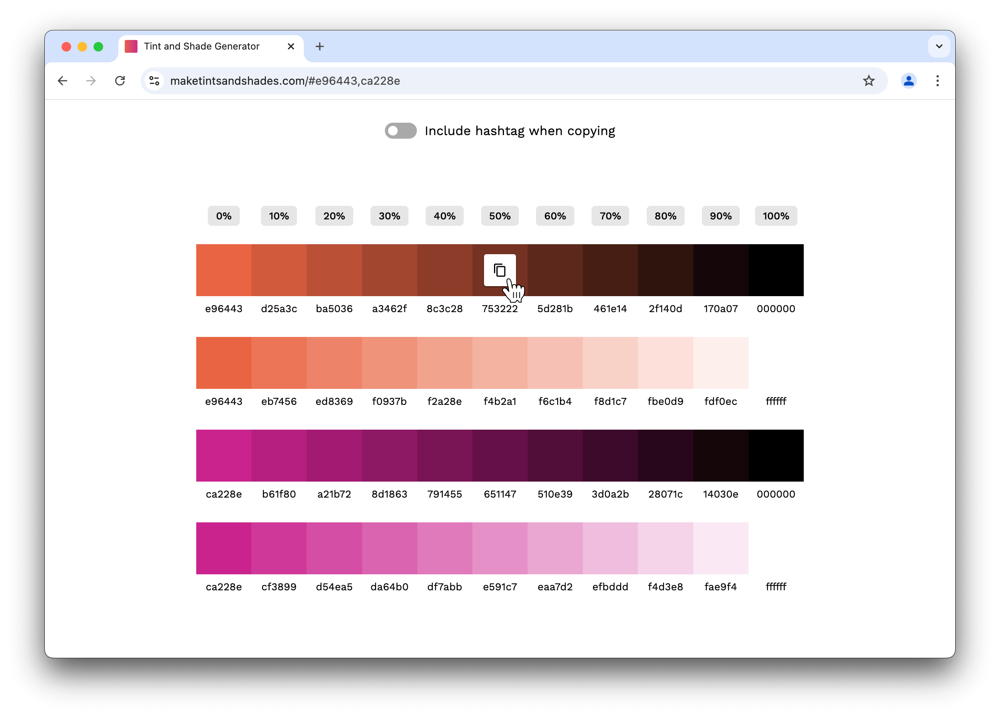

#   [Tint & Shade Generator](https://maketintsandshades.com)

<a href="https://maketintsandshades.com">
 <picture>
   <source media="(prefers-color-scheme: dark)" srcset="assets/home-dark.png" />
   <source media="(prefers-color-scheme: light)" srcset="assets/home-light.png" />
   
 </picture>
</a>

<a href="https://maketintsandshades.com">
 <picture>
   <source media="(prefers-color-scheme: dark)" srcset="assets/colors-dark.png" />
   <source media="(prefers-color-scheme: light)" srcset="assets/colors-light.png" />
   
 </picture>
</a>

## What is the Tint & Shade Generator?

The purpose of this tool is to accurately produce tints (pure white added) and shades (pure black added) of a given hex color in 10% increments.

It takes the math seriously. In my experience similar tools get the calculation incorrect due to rounding errors, creator preferences, or other inconsistencies.

Testing shows that the output matches Chrome DevTools' calculation method as well as some [established](https://css-tricks.com/snippets/sass/tint-shade-functions), [popular](https://sindresorhus.com/sass-extras/#color-function-tint) methods to derive tints and shades via Sass.

## When would I use this?

It's best used when you already have some base colors but would like complimentary colors for gradients, borders, backgrounds, shadows or other elements.

This is useful for designers who may be communicating color intent to developers who use Sass or PostCSS in their builds. It's also a solid way to quickly preview what tints and shades look like for a base color you may be considering for your design.

I've also heard it's useful for teachers, data professionals, and people who make presentations.

## Calculation method

The given hex color is first converted to RGB. Then each component of the RGB color has the following calculation performed on it, respectively.

-   **Tints:** `New value = current value + ((255 - current value) x tint factor)`
-   **Shades:** `New value = current value x shade factor`

The new value is rounded if necessary, and then converted back to hex for display.

## Example calculation

Let’s say we want tints and shades of [Rebecca Purple](https://meyerweb.com/eric/thoughts/2014/06/19/rebeccapurple/), #663399.

### 10% tint

1.  #663399 is converted to the RGB equivalent of 102, 51, 153
2.  **R:** `102 + ((255 - 102) x .1) = 117.3`, rounded to 117
3.  **G:** `51 + ((255 - 51) x .1) = 71.4`, rounded to 71
4.  **B:** `153 + ((255 - 153) x .1) = 163.2`, rounded to 163
5.  RGB 117, 71, 163 is converted to the hex equivalent of #7547a3

### 10% shade

1.  #663399 is converted to the RGB equivalent of 102, 51, 153
2.  **R:** `102 x .9 = 91.8`, rounded to 92
3.  **G:** `51 x .9 = 45.9`, rounded to 46
4.  **B:** `153 x .9 = 137.7`, rounded to 138
5.  RGB 92, 46, 138 is converted to the hex equivalent of #5c2e8a

## Feedback and contributing

This project is open source and I'd love your help!

If you notice a bug or want a feature added please [file an issue on GitHub](https://github.com/edelstone/tints-and-shades/issues/new). If you don't have an account there, just [email me](mailto:contact@maketintsandshades.com) the details.

If you're a developer and want to help with the project, please comment on [open issues](https://github.com/edelstone/tints-and-shades/issues) or create a new one and communicate your intentions. Once we agree on a path forward you can just make a pull request and take it to the finish line.

## Local development

_Prerequisites: Node.js 14+_

1.  Clone this project.
2.  Navigate to the project in your terminal.
3.  Install dependencies: `npm install`.
4.  Start the server: `npm run start`.
5.  Navigate to `localhost:8080` in your browser.

Merges and pushes to the `main` branch automatically trigger a build on the `gh-pages` branch, which deploys to GitHub Pages.

## Support this project

The Tint & Shade Generator will always be free but your support is greatly appreciated.

-   [Buy Me a Coffee](https://www.buymeacoffee.com/edelstone)
-   [Venmo](https://venmo.com/michaeledelstone)
-   [Cash App](https://cash.app/$edelstone)
-   [Paypal](https://www.paypal.me/edelstone)

## Credits

[Michael Edelstone](https://michaeledelstone.com) designed and organized the project with big-time assistance from [Nick Wing](https://github.com/wickning1) on the color calculations.

We use these amazing open-source libraries across the project:

-   [AnchorJS](https://github.com/bryanbraun/anchorjs)
-   [clipboard.js](https://github.com/zenorocha/clipboard.js)
-   [Darken](https://github.com/ColinEspinas/darken)
-   [Eleventy](https://github.com/11ty/eleventy)

Many thanks to [Joel Carr](https://github.com/joelcarr), [Sebastian Gutierrez](https://github.com/pepas24), [Tim Scalzo](https://github.com/TJScalzo), [Aman Agarwal](https://github.com/AmanAgarwal041), [Aleksandr Hovhannisyan](https://github.com/AleksandrHovhannisyan), [Shubhendu Sen](https://github.com/Sen-442b), and [Luis Escarrilla](https://github.com/latesc) for their valuable contributions.

## Other details

-   Typography: [Work Sans](https://weiweihuanghuang.github.io/Work-Sans/) by Wei Huang
-   Colors: [#000000](https://maketintsandshades.com/#000000), [#ffffff](https://maketintsandshades.com/#ffffff), [#e96443](https://maketintsandshades.com/#e96443), and [#ca228e](https://maketintsandshades.com/#ca228e)
-   Like Google's Material Design? Try [this other thing I made](https://materialpalettes.com).