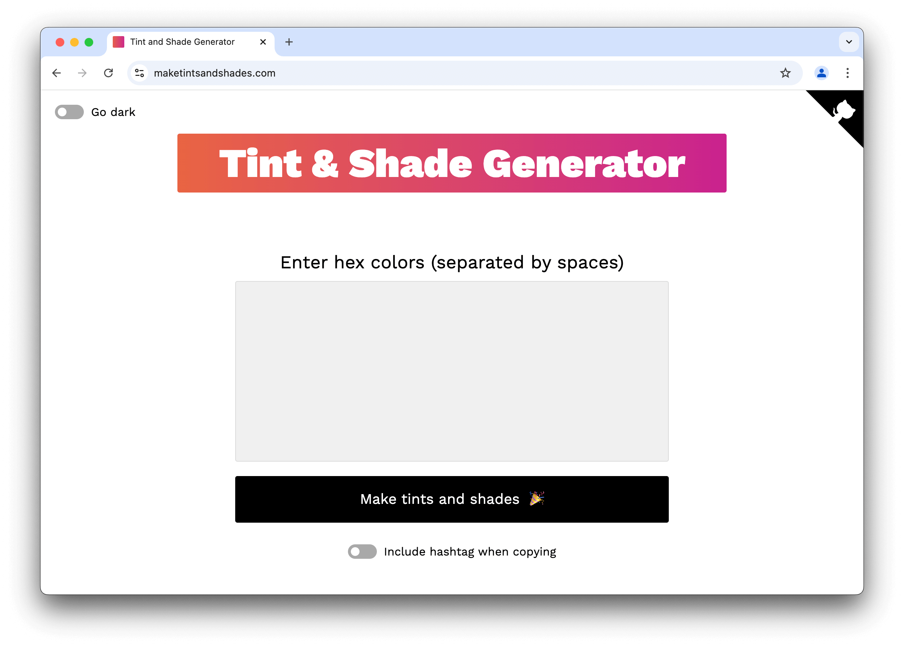

# [Tint & Shade Generator](https://maketintsandshades.com)

<a href="https://maketintsandshades.com">
 <picture>
   <source media="(prefers-color-scheme: dark)" srcset="assets/home-dark.png" />
   <source media="(prefers-color-scheme: light)" srcset="assets/home-light.png" />
   
 </picture>
</a>

<a href="https://maketintsandshades.com">
 <picture>
   <source media="(prefers-color-scheme: dark)" srcset="assets/palettes-dark.png" />
   <source media="(prefers-color-scheme: light)" srcset="assets/palettes-light.png" />
   
 </picture>
</a>

## What is the Tint & Shade Generator?

The Tint & Shade Generator is a precision color tool for producing tints (lighter variants) and shades (darker variants) from a given hex color in 5%, 10%, or 20% increments.

## Why is this tool unique?

It takes the math seriously. In my experience similar tools get the calculations incorrect due to rounding errors, creator preferences, or other inconsistencies.

Testing shows that the output matches Chrome DevTools’ calculation method as well as some [established](https://css-tricks.com/snippets/sass/tint-shade-functions), [popular](https://sindresorhus.com/sass-extras/#color-function-tint) methods to derive tints and shades via Sass.

## When would I use this?

Originally created for designer and developer teams, it’s also useful for teachers, data pros, brand strategists, presentation makers, and anyone who works with colors.

It’s perfect for:

- exploring and refining colors visually
- moving from a single color to a complete system
- generating consistent tints and shades for UI states
- building complementary palettes for accents or secondary UI
- sharing palettes via link or image
- exporting colors for design tokens, CSS, or JSON

## Calculation method

The given hex color is first converted to RGB. Each RGB component is then calculated independently as follows:

- **Tints:** `New value = current value + ((255 − current value) × tint factor)`
- **Shades:** `New value = current value × shade factor`

The “tint factor” represents the percentage of the remaining distance each RGB channel moves toward white (255), while the “shade factor” represents the percentage of the original color retained as each channel is scaled toward black (0).

The new value is rounded to the nearest whole number (values ending in .5 round up), and then converted back to hex for display.

## Example calculation

Let’s say we want tints and shades of [Rebecca Purple](https://meyerweb.com/eric/thoughts/2014/06/19/rebeccapurple/), `#663399`.

### 10% tint

1. `#663399` is converted to the RGB equivalent of `(102, 51, 153)`
2. **R:** `102 + ((255 − 102) × 0.1) = 117.3`, rounded to 117
3. **G:** `51 + ((255 − 51) × 0.1) = 71.4`, rounded to 71
4. **B:** `153 + ((255 − 153) × 0.1) = 163.2`, rounded to 163
5. RGB `(117, 71, 163)` is converted to the hex equivalent of `#7547a3`

### 10% shade

1. `#663399` is converted to the RGB equivalent of `(102, 51, 153)`
2. **R:** `102 × 0.9 = 91.8`, rounded to 92
3. **G:** `51 × 0.9 = 45.9`, rounded to 46
4. **B:** `153 × 0.9 = 137.7`, rounded to 138
5. RGB `(92, 46, 138)` is converted to the hex equivalent of `#5c2e8a`

## Related colors

In addition to generating tints and shades, you can also add related palettes based on common color-wheel relationships. These palettes shift the hue while preserving the original saturation and lightness, which is well suited to most color systems.

Hue-derived palettes require saturation. If the base color is neutral or near-neutral (very low saturation), these palettes will return the original color because neutral colors have no meaningful hue to rotate.

### Complementary

Adds one new palette using the hue directly opposite the base color (180°), producing the strongest contrast and clear visual separation.

### Split complementary

Adds two palettes using hues 30° on either side of the complementary color, keeping contrast high but less extreme than a direct complementary pairing.

### Analogous

Adds two palettes using hues 30° on either side of the base color, resulting in low-contrast, cohesive combinations suited for subtle variation.

### Triadic

Adds two palettes evenly spaced at 120° intervals around the color wheel, creating medium-high contrast with energetic, distinct relationships.

## Figma plugin

Now you can generate the same meticulously-crafted tints and shades without leaving your canvas (and automatically create local color styles, too). Grab the plugin [from the Figma Community](https://www.figma.com/community/plugin/1580658889126377365/tint-shade-generator).

## Feedback and contributing

If you notice a bug or want a feature added please [file an issue on GitHub](https://github.com/edelstone/tints-and-shades/issues/new) or just [email me](mailto:contact@maketintsandshades.com) the details.

If you’d like to contribute, comment on an [open issue](https://github.com/edelstone/tints-and-shades/issues) or open a new one describing your approach. Once aligned, submit a PR.

## Local development

_Prerequisites: Node.js 18+_

1. Clone this project.
2. Navigate to the project in your terminal.
3. Install dependencies: `npm install`.
4. Start the server: `npm run start`.
5. Navigate to `localhost:8080` in your browser.

## Core API Package

- Published on npm: [`@edelstone/tints-and-shades`](https://www.npmjs.com/package/@edelstone/tints-and-shades)
- Source location: [`packages/tints-and-shades`](packages/tints-and-shades)
- Build locally: `npm run build:api`
- Run package tests: `npm run test:api`
- App integration note: during development, the web app consumes the local workspace build at `packages/tints-and-shades/dist/index.js`.

## Support this project

- [Buy Me a Coffee](https://www.buymeacoffee.com/edelstone)
- [Cash App](https://cash.app/$edelstone)
- [PayPal](https://www.paypal.me/edelstone)
- [Venmo](https://venmo.com/michaeledelstone)

## Credits

[Michael Edelstone](https://michaeledelstone.com) designed and organized the project with major assistance from [Nick Wing](https://github.com/wickning1) on the color calculations.

Many thanks to [Joel Carr](https://github.com/joelcarr), [Sebastian Gutierrez](https://github.com/pepas24), [Tim Scalzo](https://github.com/TJScalzo), [Aman Agarwal](https://github.com/AmanAgarwal041), [Aleksandr Hovhannisyan](https://github.com/AleksandrHovhannisyan), [Shubhendu Sen](https://github.com/Sen-442b), and [Luis Escarrilla](https://github.com/latesc) for their valuable contributions.

We also utilize these amazing open-source projects:

- [Color Names](https://github.com/meodai/color-names)
- [Coloris NPM](https://github.com/melloware/coloris-npm)
- [Eleventy](https://github.com/11ty/eleventy)

## Design specs

- Typography: [Work Sans](https://weiweihuanghuang.github.io/Work-Sans/) by Wei Huang
- Iconography: [Tabler Icons](https://tabler.io/icons)
- Colors: [#000000](https://maketintsandshades.com/#colors=000000), [#1a1a1a](https://maketintsandshades.com/#colors=1a1a1a), [#e6e6e6](https://maketintsandshades.com/#colors=e6e6e6), [#ffffff](https://maketintsandshades.com/#colors=ffffff), [#e96443](https://maketintsandshades.com/#colors=e96443), and [#ca228e](https://maketintsandshades.com/#colors=ca228e)

Prefer Google’s color logic? Try the [Material Design Palette Generator](https://materialpalettes.com).
